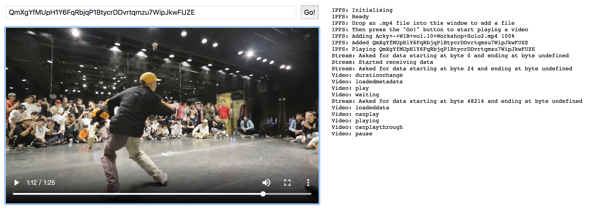

## 本书第八章案例2:基于js-ipfs搭建一个流媒体播放系统

选自官方实例项目：[Streaming video from IPFS using ReadableStreams]() 


### 运行

下载源码，文件根目录下运行：

```
$ npm install
$ npm start
```

之后在浏览器中输入[http://localhost:8888](http://localhost:8888)


### 效果

